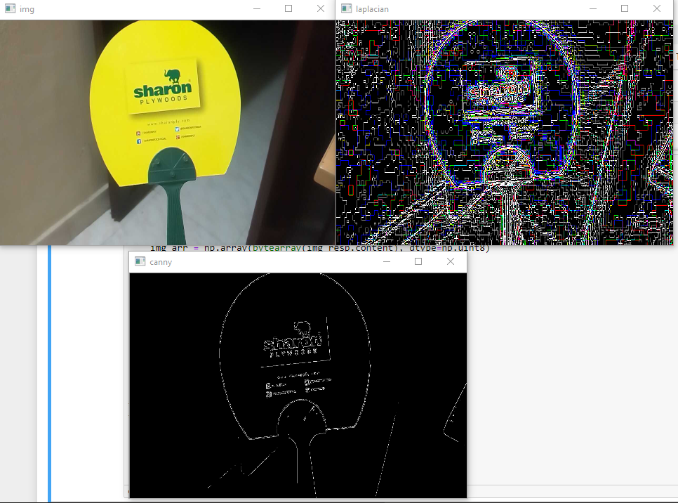
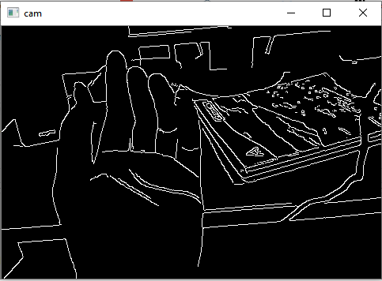
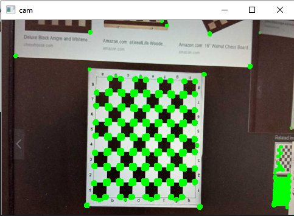

## Basics of Computer Vision
Computer vision is an interdisciplinary scientific field that deals with how computers can be made to gain high-level understanding from digital images or videos. From the perspective of engineering, it seeks to automate tasks that the human visual system can do

## My work
Below are some examples from my work to give you a visual introduction to Computer vision

